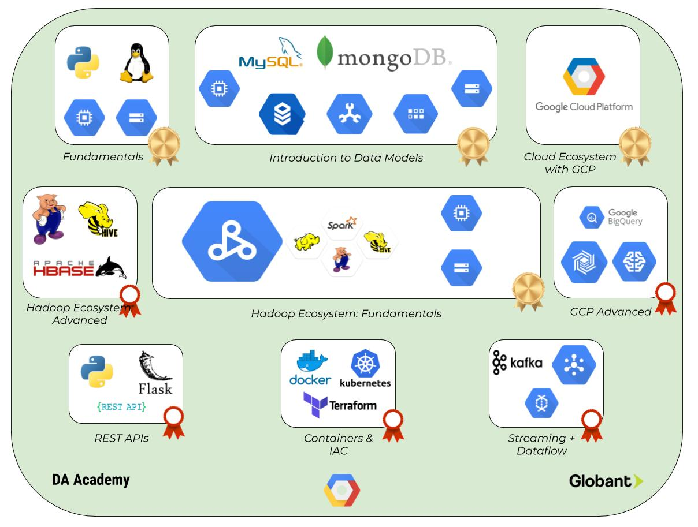

# DA Academy V2.0
## Python - Linux - Storage - Big data - Cloud Ecosystem

# Material

## DA Academy

### Are you ready for it?

### Index

1. [Objective](#objective)

2. [Who Should Attend](#who-should-attend)

3. [Duration](#duration)

4. [Technical Assistance](#technical-assistance)

5. [Performance Measurement](#performance-measurement)

6. [Materials](#materials)

7. [General Guidelines](#general-guidelines)

8. [Handling advanced Developers](#handling-advanced-developers)

9. [Sign up](#sign-up)

10. [Learning Days](#learning-days)

11. [Individual performance](#individual-performance)

12. [Earning Badges](#earning-badges)

13. [Working material](#working-material)

14. [Upon training completion](#upon-training-completion)

### Objective

This course teaches the basics of Data Architecture with the complementary stack needed for a real project. More information can be found within the [academy site](https://sites.google.com/globant.com/da-academy/home).

→ [index](#index)

### Who Should Attend

The training is aimed to beginners. A basic knowledge on OOP and databases is desired, though. Any additional knowledge is beneficial.

The goal of the acade,y is to gain data related skills. Globant will keep a record of the evaluation score of each participant, and will take it into account for future positions.

*Note: The completion of the course does not mean you will become a Data Architect automatically, nor will you be assigned to a Data project immediately.*

→ [index](#index)

### Duration

4 months (at most... fast students are encouraged, of course!)

→ [index](#index)

### Technical Assistance

You can contact other Training participants or any available tutor if you need
technical assistance. Communications will take place over [Globant Slack](https://globant.slack.com) on our own channel.

→ [index](#index)

### Performance Measurement

1. Code review at the end of the course.

2. Checkpoint completion after Learning stage with any tutor.

→ [index](#index)

### Materials

1. Laptop.

2. Install Python 3.6

3. You can choose whichever IDE you want, it could be [PyCharm](https://www.jetbrains.com/pycharm/), [Visual Studio Code](https://code.visualstudio.com/).

4. Slack Account + headset (For eventual zoom audio calls). Please, upload a profile photo to your Slack account so we can easily associate your face with your name.

5. Create your own [GitHub](https://github.com/) account. Follow this [guideline](https://help.github.com/articles/set-up-git) to setup your account. Also you can read further about Git in [Try Git](https://try.github.io/levels/1/challenges/1) or [Learn Git Branching](http://pcottle.github.io/learnGitBranching/).

6. **AWS account. Follow [this tutorial](https://aws.amazon.com/premiumsupport/knowledge-center/create-and-activate-aws-account/) to create yours. You might be asked to add a Payment method: don't worry, you won't be charged for anything during the course if you follow our guideline.** 

7. Fork this repo https://github.corp.globant.com/big-data-studio/da-academy to use as a base to host the project code. Read [this](https://help.github.com/articles/fork-a-repo/) for instructions.

→ [index](#index)

### General Guidelines

1. [Team play](http://www.dummies.com/how-to/content/ten-qualities-of-an-effective-team-player.html) is encouraged but the work will be evaluated per person.

2. The instructions will be vague as they generally are in real life projects.
You must look for support and guidance from your PM, teammates and tutors.

3. All code and documentation must be in English.

4. Every additional feature acts like a bonus. If you feel like adding technologies/methodologies/whatever you want that is not taught during the course, go for it!

→ [index](#index)

### Handling Advanced Developers

Developers that move faster than average can go ahead and complete as much exercises as wanted. Additional tools or frameworks can be used if you think that's necessary.

→ [index](#index)

### Sign Up

The Academy will be filled up on a *first-come, first-serve* basis.

Applicants may be placed on a waiting list and notified of acceptance when space becomes available on future iterations of the training, which will be held on a monthly basis.

Accepted students will have access to premium udemy courses on the program study track, support from Globant's subject experts, weekly check-up meetings, code-reviews of the practices, and a final evaluation which will be stored on Globant profile's files.

*If you are waiting for your acceptance email, you can start with the free-part of the training course.*

[Link to Registration form](https://docs.google.com/forms/d/e/1FAIpQLSe_FoHNnmHnn3a-Sh9L8rl1SDZsWKrshiwe4v5R0wZOdi9OmQ/viewform)

→ [index](#index)

### Learning Days ###

During each module you will grab the fundamentals of the key building blocks for usual DA challenges.

On each topic you will have to:

1. ### Enroll courses: ###
Each module counts with a special course link which you can visit to enroll it.

2. ### Read: ###
We will provide you with documentation related with current sprint content so you can have a background reference, guide and examples to complete the following practice.

3. ### Practice: ###
You will implement the previously gathered knowledge in simple coding/setting up activities.
Most important task numbers are listed in the "*Key Points*" section for each day and they should get most of your attention; if you feel you don’t have enough time to complete all tasks, start with these ones when possible.

4. ### Commit: ###
You will commit all your code on a daily basis, when you finish your practice.

→ [index](#index)

### Individual performance ###

After each lecture, you will be given several related exercices which act like a bonus.

General requirements:

1. Corrections will be made against your fork **master** branch. You can create any additional branch for testing purposes, but ensure your latest changes are in the main branch.

2. Exercices should be solved **individually**.   

3. Extra **documentation** is recommended (e.g., create a *spring_comments.txt* file indicating what has been done and where within your project).

4. After each topic, you will find two types of exercices. The **Practice** section is considered mandatory for everyone. The **Challenges!!** section is optional (of course, try to tackle it too. Every additional task acts like a bonus).

5. There's an **Auto assessment** section after each subject which will help you understand how you're doing. If this becomes too difficult, then you should go back and make a second read. This said, try not to leave concepts/exercices for the end. Every subject is important and it helps (in some way, it is required) to understand the following subject. 

→ [index](#index)

### Earning Badges ###

As shown in the image at the top, each Academy module comes with a badge. There are two types of badges:

* Golden badges: modules with golden badges are mandatory for every student and are considered the base of the course. 

* Red badges: modules with these badges are optional. We strongly recommend you to talk with a tutor before starting them 
in order to guide you and choose the ones which are most suitable for your career path.

In order to end the course and be able to attend an interview, golden badges are a pre-requisite and their corresponding 
modules will be considered as known. Red badges in which the student has worked will also be part of the content of 
this meeting.

→ [index](#index)

### Working Material ###

- [Introduction: Cloud Ecosystem with GCP](introduction_to_gcp/)

- [Fundamentals: Python + Linux](fundamentals/)

- [Introduction to Data Models](introduction_to_data_models/)

- [Hadoop Ecosystem: Fundamentals - Hadoop + MR](hadoop_ecosystem_fundamentals_1/)

- [Hadoop Ecosystem: Fundamentals - Spark](hadoop_ecosystem_fundamentals_2/)

- [Containers & IAC](containers_iac/)

- [REST APIs](rest_apis/)

- [Streaming + Dataflow](streaming_dataflow/)

- [Hadoop Ecosystem: Advanced](hadoop_ecosystem_advanced/)

- [GCP Advanced](gcp_advanced/)

→ [index](#index)

---

## UPON TRAINING COMPLETION

Please do not forget to fill in our feedback form to help us improve the training: [link](https://docs.google.com/forms/d/e/1FAIpQLScI2a9bJLz3p3XboqL7-Yp7KpLtSm6hHdfSmeGbpAXxbKBWuw/viewform)

→ [index](#index)
